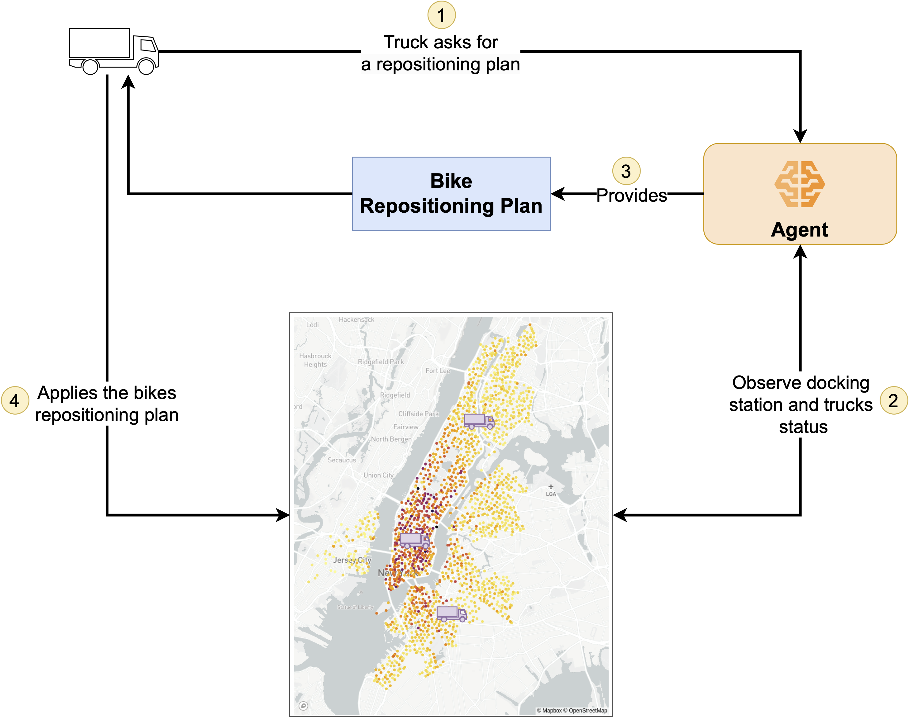

# CABRA: Cost-Aware Adaptive Bike Repositioning Agent  
_A Deep Reinforcement Learning Approach to Dynamic Bike Repositioning_

CABRA is the implementation of the methods described in our paper:

**A Cost-Aware Adaptive Bike Repositioning Agent Using Deep Reinforcement Learning**

---

## Table of Contents

- [Citation](#citation)
- [System Overview](#system-overview)
- [Contact](#contact)
- [Deployment](#deployment)
  - [Requirements](#requirements)
  - [Local Setup](#local-setup)
- [Running the Experiments](#running-the-experiments)
  - [Scheduling Runs](#schedule-a-multi-run-set)
  - [Starting a Run](#start-a-run)
- [License](#license)

---

## Citation

If you use this code in your work, please cite our paper:

```bibtex
@ARTICLE{StaffolaniCABRA2025,
    author={Staffolani, Alessandro and Darvariu, Victor-Alexandru and Bellavista, Paolo and Musolesi, Mirco},
    journal={IEEE Transactions on Intelligent Transportation Systems},
    title={A Cost-Aware Adaptive Bike Repositioning Agent Using Deep Reinforcement Learning},
    year={2025},
    volume={},
    number={},
    pages={1-11},
    keywords={Costs;Vehicle dynamics;Urban areas;Docking stations;Deep reinforcement learning;Scalability;Optimization;Electronic mail;Computer science;Shared transport;Dynamic bike repositioning;reinforcement learning;resource allocation},
    doi={10.1109/TITS.2025.3535915}
}
```

---

## System Overview

Below is an overview of the CABRA system architecture:



---

## Contact

For questions or further information, please contact:  
`alessandro.staffolani@unibo.it`

---

## Deployment

### Requirements

- **Python:** Version 3.9  
- **Docker:** Required to set up Redis and MongoDB instances.  
  > **Note:** Ensure Docker is installed and running on your system. See [Docker Documentation](https://docs.docker.com/) for installation details.
- **Redis:** Used to monitor run progress. A Docker deployment is provided.
- **MongoDB:** Used to store run configurations and summary results. A Docker deployment is provided.

### Local Setup

1. **Clone the Repository:**

    ```bash
    git clone https://github.com/AlessandroStaffolani/cabra-paper.git
    cd cabra-paper
    ```

2. **Install Python Dependencies:**

    ```bash
    pip install -r requirements.txt
    ```

3. **Start Docker Compose:**

    The provided Docker Compose file sets up both Redis and MongoDB.  
    Execute:

    ```bash
    docker compose -f docker/docker-compose.yml up -d
    ```

4. **Prepare the Dataset:**

    Follow the instructions in the [cabra-datasets](https://github.com/AlessandroStaffolani/cabra-datasets) repository to set up the necessary dataset.

---

## Running the Experiments

The repository provides a command-line interface (`cabra.py`) to schedule and execute experiments for training, validation, and evaluation.

### Schedule a Multi-run Set

This command reads a configuration file, generates a set of runs, and stores the run configurations in MongoDB while enqueuing a reference in Redis.

```bash
python cabra.py run scheduler multi-runs -mcp <config_file_path> -q <queue_name>
```

- Replace `<config_file_path>` with the path to your configuration file.
- Replace `<queue_name>` with the desired Redis queue name.

**Offline Mode:**  
If you prefer to schedule runs without using MongoDB and Redis, add the flags `--offline` and `--schedule-locally` to store scheduled runs in a local folder.

```bash
python cabra.py run scheduler multi-runs -mcp <config_file_path> -q <queue_name> --offline --schedule-locally
```

### Start a Run

After scheduling the runs, execute them using a worker. The following command processes runs sequentially until the queue is empty. To speed up execution, you can launch multiple workers in parallel.

```bash
python cabra.py run worker run-worker -p 0 --stop-empty -q <queue_name>
```

**Offline Worker:**  
For offline runs, use the `offline-worker` command:

```bash
python cabra.py run worker offline-worker --stop-empty -q <queue_name>
```

> **Note:**  
> The `-q` flag indicates the queue name (or, in offline mode, the local folder) where the runs have been scheduled. Multiple processes can pull runs from the same offline folder if needed.

---

## License

This repository is provided for academic use. Please refer to the [LICENSE](LICENSE) file for further details.

---
